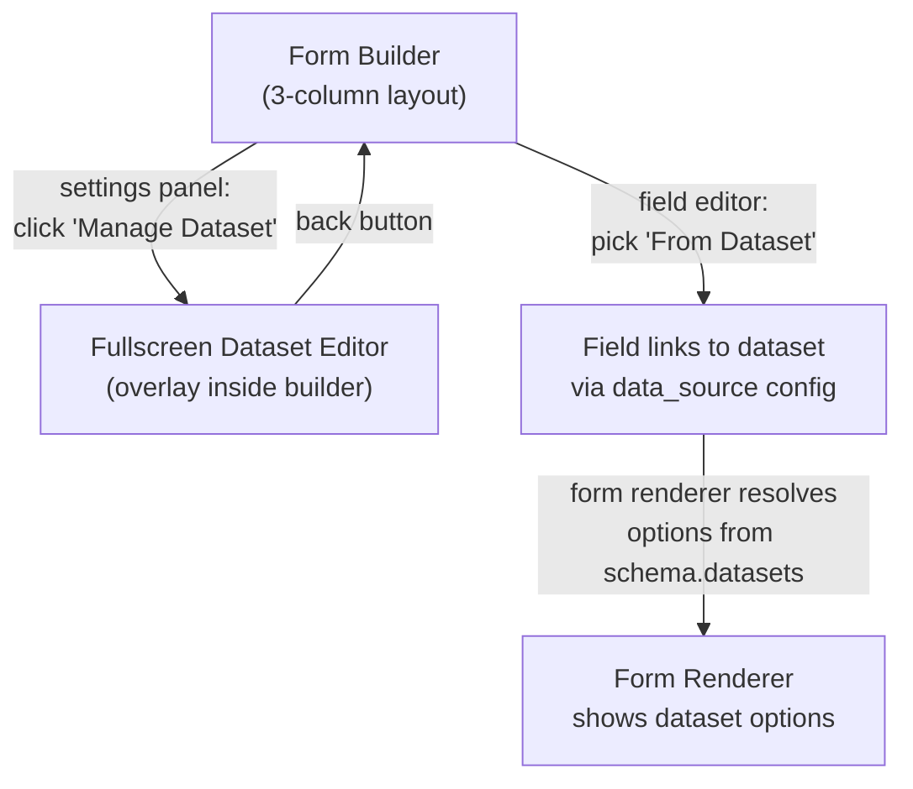

# Per-Form Datasets -- Mini Databases

## UX Flow




### Step 1: Settings Panel -- Entry Point

In the **left settings panel** of the form builder ([form-builder.tsx](src/components/form-builder/form-builder.tsx)), add a new section below "After Submit":

```
--- Separator ---
[Database icon] מאגרי מידע

  [+ Gift List]  [x]     <-- existing dataset chip (click to edit, x to delete)
  [+ Add Dataset]         <-- button to create new

  -- or if no datasets --
  "No datasets yet"
  [+ Create Dataset]
```

Clicking a dataset chip or "Create" **transitions to the fullscreen overlay**.

### Step 2: Fullscreen Dataset Editor (the core UI)

A full-width/height overlay that covers the form builder (like a sub-page, not a dialog). Structure:

```
+------------------------------------------------------------+
| [<-- Back to Builder]       "Gift List"       [Delete Dataset] |
+------------------------------------------------------------+
| Columns toolbar:                                              |
|   [+ Add Column]   Column count: 3                            |
+------------------------------------------------------------+
|  Name (text)    |  Price (number)  |  SKU (text)    |  [...]  |
|  [pencil icon]  |  [pencil icon]   |  [pencil icon] |         |
+-----------------+------------------+----------------+---------+
|  Bluetooth Speaker  |  89           |  SPK-001       |   x     |
|  Gift Card $50      |  50           |  GC-050        |   x     |
|  Desk Lamp          |  120          |  LAMP-003      |   x     |
|  ...                |  ...          |  ...           |   x     |
+-----------------+------------------+----------------+---------+
| [+ Add Row]                                                   |
+------------------------------------------------------------+
| CSV Import (phase 2)                                          |
+------------------------------------------------------------+
```

Key behaviors:

- **Column header edit**: click pencil to rename, change type (text/number), or delete column
- **Inline cell editing**: click a cell to edit in-place (Input for text, number input for numbers)
- **Add/remove rows**: "+" button at bottom, "x" on each row
- **Auto-save**: changes update the React state; saved when the user saves the entire form
- **RTL layout**: table scrolls horizontally if many columns, fits naturally in RTL

This component is `dataset-editor.tsx` -- a new file.

### Step 3: Field Editor -- "From Dataset" Source

In [field-editor-panel.tsx](src/components/form-builder/field-editor-panel.tsx), for dropdown/multiselect/radio fields, add a toggle above the manual options list:

```
Option source:
  [Manual]  [From Dataset]    <-- toggle buttons

When "From Dataset" is selected:
  Dataset:     [v Gift List    ]   <-- Select dropdown
  Show column: [v Name         ]   <-- which column to display as label
  Save column: [v SKU          ]   <-- which column value goes into response

  Preview: "Bluetooth Speaker", "Gift Card $50", "Desk Lamp"
```

When "From Dataset" is active, the manual options editor is hidden. When "Manual" is active, `data_source` is cleared.

### Step 4: Form Renderer -- Resolve Options

In [form-renderer.tsx](src/components/form-renderer/form-renderer.tsx), before rendering a choice field, check if `field.data_source` exists. If so, build the options from `form.schema.datasets`:

```typescript
function resolveFieldOptions(field: FieldConfig, form: Form): string[] {
  if (field.data_source) {
    const dataset = form.schema.datasets?.find(d => d.id === field.data_source!.dataset_id)
    if (dataset) {
      return dataset.rows.map(row => String(row[field.data_source!.label_column] ?? ""))
    }
  }
  return field.options ?? []
}
```

The submitted value uses `value_column` (or falls back to `label_column`).

---

## Data Model

### New types in [src/lib/types.ts](src/lib/types.ts)

```typescript
interface DatasetColumn {
  id: string
  name: string
  type: "text" | "number"
}

interface DatasetRow {
  id: string
  [columnId: string]: string | number
}

interface FormDataset {
  id: string
  name: string
  columns: DatasetColumn[]
  rows: DatasetRow[]
}
```

Update `FormSchema`:

```typescript
interface FormSchema {
  datasets?: FormDataset[]
  [key: string]: unknown
}
```

Add to `FieldConfig`:

```typescript
data_source?: {
  dataset_id: string
  label_column: string
  value_column: string
}
```

### Storage: No DB migration needed

The `forms.schema` JSONB column already exists and is empty (`{}`). Dataset data will be stored there. The existing `createForm` / `updateForm` actions already persist `schema`.

### What changes in form-builder.tsx save logic

Line 327 currently says `schema: {}`. This changes to pass the datasets state:

```typescript
schema: { datasets: datasets.length > 0 ? datasets : undefined },
```

---

## Files Summary


| File                                                                                                                   | Change                                                                                                      |
| ---------------------------------------------------------------------------------------------------------------------- | ----------------------------------------------------------------------------------------------------------- |
| [src/lib/types.ts](src/lib/types.ts)                                                                                   | Add `FormDataset`, `DatasetColumn`, `DatasetRow`; update `FormSchema`, `FieldConfig`                        |
| [src/components/form-builder/form-builder.tsx](src/components/form-builder/form-builder.tsx)                           | Add datasets state, entry point in settings panel, fullscreen overlay toggle, pass datasets to save payload |
| **NEW** `src/components/form-builder/dataset-editor.tsx`                                                               | Fullscreen spreadsheet editor component                                                                     |
| [src/components/form-builder/field-editor-panel.tsx](src/components/form-builder/field-editor-panel.tsx)               | Add "Manual / From Dataset" toggle for dropdown/radio/multiselect                                           |
| [src/components/form-renderer/form-renderer.tsx](src/components/form-renderer/form-renderer.tsx)                       | Resolve dataset-backed options before rendering                                                             |
| [src/components/form-renderer/fields/dropdown-field.tsx](src/components/form-renderer/fields/dropdown-field.tsx)       | Accept resolved options (minor)                                                                             |
| [src/components/form-renderer/fields/radio-field.tsx](src/components/form-renderer/fields/radio-field.tsx)             | Accept resolved options (minor)                                                                             |
| [src/components/form-renderer/fields/multiselect-field.tsx](src/components/form-renderer/fields/multiselect-field.tsx) | Accept resolved options (minor)                                                                             |


No database migrations. No new RLS policies. No new server actions.